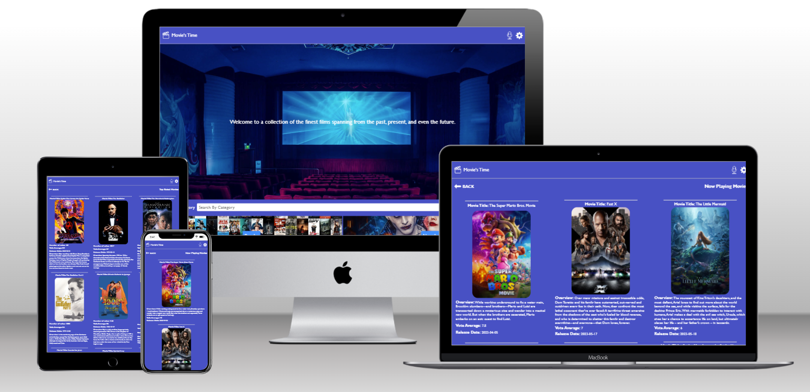

<a name="readme-top"></a>


<div align="center">

  <h1><b>Movie's Time App</b></h1>
  

</div>

<!-- TABLE OF CONTENTS -->

# 📗 Table of Contents

- [📗 Table of Contents](#-table-of-contents)
- [📖 Movie's Time App](#-movies-time-app)
  - [🛠 Built With ](#-built-with-)
    - [Tech Stack ](#tech-stack-)
    - [Key Features ](#key-features-)
  - [🚀 Live Demo ](#-live-demo-)
  - [💻 Getting Started ](#-getting-started-)
    - [Prerequisites](#prerequisites)
    - [Setup](#setup)
    - [Install](#install)
    - [Usage](#usage)
    - [Run tests](#run-tests)
    - [Deployment](#deployment)
  - [👥 Authors ](#-authors-)
  - [🔭 Future Features ](#-future-features-)
  - [🤝 Contributing ](#-contributing-)
  - [⭐️ Show your support ](#️-show-your-support-)
  - [🙏 Acknowledgments ](#-acknowledgments-)
  - [📝 License ](#-license-)

<!-- PROJECT DESCRIPTION -->

# 📖 Movie's Time App<a name="about-project"></a>

The **Movie's Time**  is a web application specially designed for movie lovers. Powered by React and Redux, this application categorizes the top trending movies into four sections: Popular, Top Rated, Now Playing, and Upcoming.

Upon accessing the Movie's Time App, users can explore dedicated data for each category:

- 📽️ Popular: Displays the vote average, with feedback from  hundreds and even thousands of movie lovers.
- 🔝 Top Rated: Provides an overview of the all-time highest-rated movies.
- 🍿 Now Playing: Enables users to keep track of movies currently being shown in theaters.
- 🎉 Upcoming: Provides release dates for upcoming movies.

This application utilizes information from [The Movie DB](https://www.themoviedb.org/).

## 🛠 Built With <a name="built-with"></a>

### Tech Stack <a name="tech-stack"></a>


<details>
  <summary>HTML</summary>
  <ul>
    <li>HTML</li>
  </ul>
</details>

<details>
  <summary>CSS</summary>
  <ul>
    <li>CSS</li>
  </ul>
</details>

<details>
  <summary>Javascript</summary>
  <ul>
    <li>Javascript</li>
  </ul>
</details>

<!-- Features -->

### Key Features <a name="key-features"></a>

- Use of React documentation.
- Use of React components.
- Use of React props.
- Use of React Router.
- Connect of React and Redux.
- Handle events in a React app.
- Write integration tests with a React testing library.
- Use of styles in a React app.
- Use of React life cycle methods.
- Apply React best practices and language style guides in code.
- Use of store, actions and reducers in React.

<p align="right">(<a href="#readme-top">back to top</a>)</p>

<!-- LIVE DEMO -->

## 🚀 Live Demo <a name="live-demo"></a>

- Here is the [live demo version](https://movies_time.onrender.com).

<p align="right">(<a href="#readme-top">back to top</a>)</p>

<!-- GETTING STARTED -->

## 💻 Getting Started <a name="getting-started"></a>

To get a local copy up and running, follow these steps:

 ```bash
 clone this repository into your machine
 npm start
```

### Prerequisites

In order to run this project you need:

- Create a repo on your repositores files.
- Clone or make a copy of this repo on your local machine.
- Follow GitHub flow.
- A carefully reading of this README.md is required.

### Setup

Clone this repository to your desired folder:
 
 ```bash
 cd my-folder
 git clone git@github.com:oovillagran/capstone.git
```

### Install

Install this project with:

 ```bash
 npm install
```

### Usage

To run the project, you can use your favorite browser.


### Run tests

To run tests, execute the following command:

```bash
 npm test
```

### Deployment

- N/A

<p align="right">(<a href="#readme-top">back to top</a>)</p>

<!-- AUTHORS -->

## 👥 Authors <a name="authors"></a>

👤 **Oscar Villagran**

- GitHub: [@oovillagran](https://github.com/oovillagran)
- Twitter: [@oovillagran](https://twitter.com/oovillagran)
- LinkedIn: [Oscar Villagran](https://www.linkedin.com/in/oovillagran/)

<p align="right">(<a href="#readme-top">back to top</a>)</p>

<!-- FUTURE FEATURES -->

## 🔭 Future Features <a name="future-features"></a>

- [ ] **User Logging.**
- [ ] **User Authentication**


<p align="right">(<a href="#readme-top">back to top</a>)</p>

<!-- CONTRIBUTING -->

## 🤝 Contributing <a name="contributing"></a>

Contributions, issues, and feature requests are welcome!

Feel free to check the [issues page](../../issues/).

<p align="right">(<a href="#readme-top">back to top</a>)</p>

<!-- SUPPORT -->

## ⭐️ Show your support <a name="support"></a>

If you like this project feel free to make any comment, all contributions are welcome!.

<p align="right">(<a href="#readme-top">back to top</a>)</p>

<!-- ACKNOWLEDGEMENTS -->

## 🙏 Acknowledgments <a name="acknowledgements"></a>

I would like to thank Microverse comunity. I thank our learning, morning session and standup partners for supporting me.

Thanks to the [Creative Commons](https://creativecommons.org/licenses/by-nc/4.0/) and [Nelson Sakwa on Behance](https://www.behance.net/sakwadesignstudio) for provided the main UI [design](https://www.behance.net/gallery/31579789/Ballhead-App-(Free-PSDs)).

<p align="right">(<a href="#readme-top">back to top</a>)</p>

## 📝 License <a name="license"></a>

This project is [MIT](LICENSE.md) licensed.

<a href="LICENSE.md">

<p align="right">(<a href="#readme-top">back to top</a>)</p>
